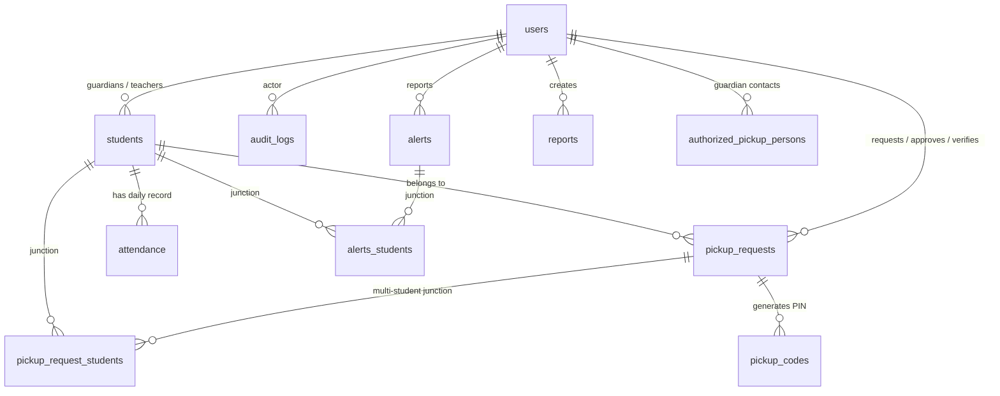

# 🛡️ Safe Child — Campus Safety & Pickup Management System


**Safe Child** (also branded under Educal Complex) is a web application engineered for educational institutions, campus security teams, teachers, and parents. The platform bridges the gap between educational administration and child security by managing student rosters, automating secure multi-stage pickup verification, tracking daily attendance, reporting security incidents, managing network security policies, and maintaining immutable audit logging.

---
## Installation for android


## version 1
https://expo.dev/accounts/ecodelabs/projects/safe-child-app/builds/c74e286d-d59b-4090-9530-54045cda2294

## version 2
https://expo.dev/accounts/ecodelabs/projects/safe-child-app/builds/81596034-ba3b-4965-b043-3bdf6b3e6377

## Admin web portal
https://safe-child-app.vercel.app/
---

##  Table of Contents

- [Overview & Objectives](#-overview--objectives)
- [Key Features & Capabilities](#-key-features--capabilities)
- [User Roles & Permissions](#-user-roles--permissions)
- [Complete Directory Structure](#-complete-directory-structure)
- [Database Architecture & Schema](#-database-architecture--schema)
- [Technology Stack & Design System](#-technology-stack--design-system)
- [Installation & Local Setup](#-installation--local-setup)
- [Configuration & Email Integration](#-configuration--email-integration)
- [System Workflows](#-system-workflows)
- [Core API & Helper Functions](#-core-api--helper-functions)
- [Security & Compliance](#-security--compliance)

---

## Overview & Objectives

In modern educational environments, child safety during pickup hours, campus entry/exit, and emergency events is critical. **Safe Child** offers:

1. **Peace of Mind for Parents**: Real-time status of children, direct pickup request creation with authorized guardian photo proofs, and PIN code verification.
2. **Operational Efficiency for Teachers**: Fast daily attendance recording (Present/Absent/Late), class roster management, and emergency incident escalation.
3. **Strict Verification for Pickup Verifiers**: Ground-level campus gates verification using digital photo proof matching, PIN validation, and immediate status updates (`Verified` & `Released`).
4. **Complete Administrative Control**: User account provisioning, student-guardian pairing, network IP whitelisting/blocking, email SMTP setup, and comprehensive audit logs.

---

## 🚀 Key Features & Capabilities

### 1.  Student Registry & Roster Management
- Register students with grade levels, guardian details, and teacher assignments.
- Upload student profile photos (`assets/uploads/students/`).
- Link multiple students to a single parent account.
- Direct guardian communication from the registry with sent email persistence.

### 2.  Multi-Stage Pickup Authorization & Verification
- **Request Creation**: Parents schedule pickups, specifying recipient name, phone number, notes, pickup time/date, and upload photo proof (`assets/uploads/pickups/`). Multi-child selection is supported.
- **Administrative Approval**: Admins review and approve pickup requests (`Pending` ➔ `Approved`).
- **Campus Handover Verification**: Designated `pickup_verifier` staff verify recipient photo proof on campus gates, approving release (`Approved` ➔ `Verified` / `Released`).
- **PIN-Based Verification**: Hashed one-time PIN generation (`pickup_codes`) with expiration time checks.
- **Pre-Authorized Pickup Persons**: Maintain a whitelist of authorized pickup contacts (`authorized_pickup_persons`) linked to parent accounts.

### 3. 📋 Daily Attendance System
- Track attendance by date per student (`attendance` table with unique date-student constraint).
- Attendance statuses: `Present`, `Absent`, `Late`.
- Optional teacher notes for record keeping.

### 4.  Security Dashboard & Incident Reporting
- Log safety incidents and campus security alerts with severity levels (`Low`, `Medium`, `High`) and statuses (`Open`, `Acknowledged`, `Resolved`).
- Map alerts to specific impacted students via junction table (`alerts_students`).
- Security Analytics dashboard featuring visual metric cards, charts, and CSV data export capabilities.
- Safety report generator for incident logs, arrival reviews, and administrative sign-offs.

### 5. 🛡️ Network Security & IP Access Control
- **IP Whitelisting**: Grant trusted access to campus networks (`ip_whitelist`).
- **IP Blocking**: Block suspicious IP addresses with recorded justification, expiration timestamps, and confirmation dialogues (`ip_blocks`).

### 6. ✉️ Email Notifications & PHPMailer Integration
- SMTP integration with SSL/TLS encryption support (`mailer.php`).
- Customizable email templates for reports and PIN notifications (`email_templates`).
- Sent email archiving and log history (`inbox_entries`).
- Dynamic runtime setting management (`settings` table).

### 7. 🚌 Campus Communication & Operations
- **Bus Schedule Tracking**: View bus routes, driver names, departure/arrival timetables.
- **PTA Meetings Schedule**: Broadcast Parent-Teacher Association meetings and locations.
- **School Announcements**: Publish announcements targeted to all or specific audiences.

### 8. 🔍 Compliance & System Audit Trail
- Automated activity tracking for user logins, password resets, user creations, report updates, and email transmissions (`audit_logs`).
- **GDPR & Privacy Compliance**: Track user privacy consents (`privacy_consents`) and process data access/deletion requests (`data_requests`).

---

## 👥 User Roles & Permissions

The application implements granular Role-Based Access Control (RBAC) across 5 primary roles:

| Role | Badge Key | Core Responsibilities & Access Scope |
| :--- | :--- | :--- |
| **Administrator** | `admin` | Full system control: User management, student registry, pickup approval, security settings, IP blocking/whitelisting, email configuration, audit logs, and page content management. |
| **Teacher** | `teacher` | Class roster management, daily student attendance marking, bus schedule viewing, incident report drafting, emergency alert triggering. |
| **Parent / Guardian** | `parent` | View linked children profiles, create pickup requests with photo proofs, view announcements and PTA schedules, submit incident reports. |
| **Pickup Verifier** | `pickup_verifier` | Specialized gate staff: Access dedicated verification portal to match physical pickup arrivals against uploaded photo proof and PINs, marking students as `Verified` and `Released`. |
| **Security Team** | `security` | Monitor security dashboard, track emergency alerts, export security analytics, inspect audit trails. |

---

## 📁 Complete Directory Structure

```text
Safe_Child/
│
├── assets/                             # Static visual assets & file uploads
│   ├── css/                            # Custom stylesheets & component styles
│   ├── images/                         # Static images (school background, logos)
│   └── uploads/                        # User-uploaded dynamic media
│       ├── pickups/                    # Verification photo proofs for pickup requests
│       └── students/                    # Student profile pictures
│
├── docs/                               # Project documentation
│   ├── design.md                       # Corporate Modern design system specs (colors, typography)
│   └── privacy.md                      # Data protection & privacy policies
│
├── old files/                          # Legacy & backup references
│
├── pages/                              # Modular UI template pages (HTML components)
│   ├── admin-panel.html
│   ├── alert-configuration-settings.html
│   ├── arrange-pickup.html
│   ├── blocked-ip-management.html
│   ├── bus-schedule-tracking.html
│   ├── confirm-ip-block.html
│   ├── customize-pin-notification-templates.html
│   ├── edit-email-notification-template.html
│   ├── email-delivery-settings.html
│   ├── email-delivery-settings-password-protected.html
│   ├── generate-secure-pin.html
│   ├── login-register.html
│   ├── parent-portal.html
│   ├── pta-meeting-schedule.html
│   ├── refined-security-alert-details.html
│   ├── school-announcements.html
│   ├── security-analytics-export-enabled.html
│   ├── security-dashboard.html
│   ├── security-dashboard-export-enabled.html
│   ├── security-dashboard-visualizations.html
│   ├── security-report-generator.html
│   ├── security-report-generator-with-email-settings.html
│   ├── student-registry.html
│   ├── system-audit-logs.html
│   ├── teacher-portal.html
│   ├── teacher-portal-emergency-alert.html
│   ├── user-management.html
│   ├── user-pin-management.html
│   ├── user-profile-settings.html
│   └── whitelisted-ip-management.html
│
├── apply_mail_settings.php             # Script to sync database mail settings to runtime config
├── config.php                          # Global configuration constants (DB credentials, Mail, Sessions)
├── create_alerts_students_table.php    # Migration script for alert-student junction table
├── db.php                              # PDO database connection & query helper functions
├── debug_mail_settings.php             # Troubleshooting utility for SMTP mail settings
├── footer.php                          # Global page footer component
├── functions.php                       # Core business logic, RBAC, session management & helpers
├── header.php                          # Global navigation bar & header component
├── index.php                           # Application landing page & parent Quick View dashboard
├── init.php                            # App bootstrapper (schema auto-migrations, session setup)
├── install.php                         # Application initial installer script
├── login-register.php                  # Authentication handler (Login, Register, OTP verification)
├── logout.php                          # Session destruction & logout handler
├── mailer.php                          # PHPMailer integration & system email dispatcher
├── page.php                            # Dynamic page router & controller (handles all POST & GET actions)
├── register_test.php                   # Test utility for registration flow validation
├── reset-password.php                  # Password reset token handler & workflow
└── safe_child (1).sql                  # Full database SQL dump schema & initial seed data
```

---

## 🗄️ Database Architecture & Schema

The relational database (`safe_child`) consists of **22 tables** designed with strict foreign key constraints, indexes, and automated schema migration handling in `init.php`.



### Table Breakdown

#### 1. `users` — System Accounts
Stores authentication credentials, user roles, security tokens, and profile data.
- **Columns**: `id` (PK, Auto-Inc), `name`, `email` (Unique), `password_hash`, `role` (`admin`, `teacher`, `parent`, `security`, `pickup_verifier`), `status` (`active`, `inactive`), `otp_code`, `otp_expires_at`, `reset_token`, `reset_expires_at`, `access_pin`, `phone`, `created_at`, `updated_at`.

#### 2. `students` — Student Roster
Stores enrolled students linked to guardians and teachers.
- **Columns**: `id` (PK, Auto-Inc), `first_name`, `last_name`, `grade`, `guardian_name`, `guardian_email`, `guardian_phone`, `guardian_user_id` (FK ➔ `users.id`), `teacher_user_id` (FK ➔ `users.id`), `photo_path`, `status`, `created_at`, `updated_at`.

#### 3. `pickup_requests` — Pickup Authorization Handovers
Maintains child pickup authorizations and verification status.
- **Columns**: `id` (PK, Auto-Inc), `student_id` (FK ➔ `students.id`), `requested_by_user_id` (FK ➔ `users.id`), `approved_by_user_id` (FK ➔ `users.id`), `verified_by_user_id` (FK ➔ `users.id`), `verified_at`, `released_at`, `pickup_name`, `pickup_phone`, `pickup_image_path`, `status` (`Pending`, `Approved`, `Verified`, `Released`), `pickup_time`, `pickup_date`, `notes`, `created_at`, `updated_at`.

#### 4. `pickup_request_students` — Multi-Student Pickup Junction
Allows a single pickup request to apply to multiple children.
- **Columns**: `pickup_request_id` (PK, FK ➔ `pickup_requests.id`), `student_id` (PK, FK ➔ `students.id`).

#### 5. `authorized_pickup_persons` — Guardian Authorized Contacts
Pre-registered contacts authorized by guardians for student pickup.
- **Columns**: `id` (PK, Auto-Inc), `guardian_user_id` (FK ➔ `users.id`), `name`, `phone`, `photo_path`, `status` (`active`, `revoked`), `created_at`, `updated_at`.

#### 6. `pickup_codes` — Verification PIN Codes
One-time security access PIN codes linked to pickup requests.
- **Columns**: `id` (PK, Auto-Inc), `pickup_request_id` (FK ➔ `pickup_requests.id`), `code_hash`, `expires_at`, `used_at`, `created_at`.

#### 7. `attendance` — Student Attendance Logs
Daily student presence/absence logs recorded by teachers or administrators.
- **Columns**: `id` (PK, Auto-Inc), `student_id` (FK ➔ `students.id`), `attendance_date`, `status` (`Present`, `Absent`, `Late`), `recorded_by_user_id` (FK ➔ `users.id`), `notes`, `created_at`, `updated_at`.
- **Constraint**: Unique key `student_date` on (`student_id`, `attendance_date`).

#### 8. `alerts` — Campus Security Alerts
Logs active security concerns and emergency alerts.
- **Columns**: `id` (PK, Auto-Inc), `reported_by_user_id` (FK ➔ `users.id`), `title`, `description`, `severity` (`Low`, `Medium`, `High`), `status` (`Open`, `Acknowledged`, `Resolved`), `created_at`, `updated_at`.

#### 9. `alerts_students` — Alert-Student Mapping
Junction table linking security alerts to specific impacted students.
- **Columns**: `alert_id` (PK, FK ➔ `alerts.id`), `student_id` (PK, FK ➔ `students.id`).

#### 10. `reports` — Incident & Safety Reports
Safety assessment reports created by staff or parents.
- **Columns**: `id` (PK, Auto-Inc), `report_type`, `title`, `content`, `status` (`Draft`, `Reviewed`, `Resolved`), `created_by_user_id` (FK ➔ `users.id`), `created_at`, `updated_at`.

#### 11. `audit_logs` — Immutable Audit Trail
Tracks system events with actor user ID, client IP address, and JSON metadata.
- **Columns**: `id` (PK, Auto-Inc), `user_id` (FK ➔ `users.id`), `event`, `ip_address`, `metadata`, `created_at`.

#### 12. `ip_blocks` — Blocked IP Addresses
Network security list of blocked IP addresses with reason and expiration.
- **Columns**: `id` (PK, Auto-Inc), `ip_address`, `reason`, `blocked_by_user_id` (FK ➔ `users.id`), `status`, `expires_at`, `created_at`.

#### 13. `ip_whitelist` — Whitelisted Campus IPs
Trusted IP addresses granted bypass or administrative privileges.
- **Columns**: `id` (PK, Auto-Inc), `ip_address`, `reason`, `added_by_user_id` (FK ➔ `users.id`), `created_at`.

#### 14. `bus_schedules` — Transportation Tracking
Bus routes, driver names, and departure/arrival timetables.
- **Columns**: `id` (PK, Auto-Inc), `route_number`, `driver_name`, `departure_time`, `arrival_time`, `notes`.

#### 15. `pta_meetings` — PTA Community Meetings
Schedule of Parent-Teacher Association events.
- **Columns**: `id` (PK, Auto-Inc), `title`, `meeting_date`, `location`, `description`, `created_at`.

#### 16. `announcements` — School Bulletins
Announcements published to families and staff.
- **Columns**: `id` (PK, Auto-Inc), `title`, `body`, `audience`, `is_published`, `published_at`, `created_at`.

#### 17. `email_templates` — Dynamic Notification Templates
Email templates for automated notifications.
- **Columns**: `id` (PK, Auto-Inc), `name`, `subject`, `body`, `created_at`, `updated_at`.

#### 18. `inbox_entries` — Sent Email Archive
Stores an audit copy of system emails dispatched to parents and staff.
- **Columns**: `id` (PK, Auto-Inc), `from_admin_user_id` (FK ➔ `users.id`), `to_email`, `to_name`, `subject`, `body_html`, `body_text`, `created_at`.

#### 19. `settings` — System Key-Value Configuration
Dynamic configuration settings for SMTP, notifications, and auto-escalation.
- **Columns**: `key` (PK), `value`.

#### 20. `page_contents` — Dynamic Page Content
Dynamic page titles, body content, and descriptions linked by slug.
- **Columns**: `id` (PK, Auto-Inc), `slug` (Unique), `title`, `content`, `created_at`, `updated_at`.

#### 21. `privacy_consents` — GDPR Consents
Tracks user privacy agreement consents and revocations.
- **Columns**: `id` (PK, Auto-Inc), `user_id` (FK ➔ `users.id`), `consent_type`, `consented_at`, `withdrawn_at`.

#### 22. `data_requests` — Subject Data Requests
User requests for data access or account deletion.
- **Columns**: `id` (PK, Auto-Inc), `user_id` (FK ➔ `users.id`), `request_type` (`access`, `deletion`), `status` (`pending`, `completed`, `rejected`), `created_at`, `completed_at`.

---

## 🎨 Technology Stack & Design System

### Technology Stack
- **Language & Runtime**: PHP 8.2+
- **Database Engine**: MySQL 8.0+ / MariaDB 10.4+ (InnoDB Engine, `utf8mb4_general_ci`)
- **Mailer Module**: PHPMailer (SMTP configuration with TLS/SSL options)
- **Frontend Stack**: HTML5, Vanilla JavaScript (ES6+), Tailwind CSS (via CDN/custom bundle)
- **Icons & Typography**: Material / SVG Vector Icons, Inter Google Font

### Design System Highlights (`docs/design.md`)
- **Aesthetic**: Corporate Modern — authoritative, clean, and legibility-focused.
- **Color Palette**:
  - **Primary Navy**: `#002045` (Headers, structural navigation)
  - **Safety Blue**: `#1960a3` (Primary call-to-actions, focus states)
  - **Success Green**: Status badges for verified check-ins and approved pickups
  - **Emergency Red**: `#ba1a1a` (Un-authorized alerts, emergency actions)
  - **Neutral Surface**: `#f8f9ff` (High-contrast cool-toned backgrounds)
- **Grid System**: 8px baseline rhythm, 12-column desktop layout (max-width 1280px), 4-column fluid mobile grid.

---

## ⚙️ Installation & Local Setup

### Prerequisites
- **XAMPP / WAMP / MAMP** with PHP 8.2 or higher and MariaDB/MySQL.
- Web server configured to serve `c:\xampp2\htdocs\Safe_Child` or mapped local directory.

### Step-by-Step Setup

1. **Clone or Position Repository**:
   Place project files inside your local web server document root:
   ```bash
   c:\xampp2\htdocs\Safe_Child
   ```

2. **Database Import**:
   - Open phpMyAdmin (`http://localhost/phpmyadmin`) or your MySQL CLI.
   - Create a database named `safe_child`:
     ```sql
     CREATE DATABASE safe_child CHARACTER SET utf8mb4 COLLATE utf8mb4_general_ci;
     ```
   - Import the database dump file:
     ```bash
     mysql -u root -p safe_child < "c:\xampp2\htdocs\Safe_Child\safe_child (1).sql"
     ```

3. **Verify Configuration (`config.php`)**:
   Ensure database connection parameters match your MySQL setup:
   ```php
   define('DB_HOST', '127.0.0.1');
   define('DB_NAME', 'safe_child');
   define('DB_USER', 'root');
   define('DB_PASS', '');
   ```

4. **Launch Application**:
   Open your browser and navigate to:
   ```text
   http://localhost/Safe_Child/
   ```

---

## ✉️ Configuration & Email Integration

### Default Test Accounts (Initial Seed Data)

| Role | Email | Password | Access Details |
| :--- | :--- | :--- | :--- |
| **Administrator** | `kingsleyeshunmintah@gmail.com` | *(Seeded Hash)* | Full access to Admin Panel & Security settings |
| **Teacher** | `joshuaofori879@gmail.com` | *(Seeded Hash)* | Teacher Portal, rosters, & attendance |
| **Parent** | `ecode517@gmail.com` | *(Seeded Hash)* | Parent Portal & Pickup Request workflow |
| **Security Team** | `awuahselinabaffour@gmail.com` | *(Seeded Hash)* | Security Dashboard & Incident tracking |
| **Pickup Verifier** | `oforijoshua198@gmail.com` | *(Seeded Hash)* | Dedicated Pickup Verification Portal |

*(Note: Passwords can be reset via `reset-password.php` or updated directly by administrators in User Management).*

### SMTP Mail Configuration
Application email parameters are stored dynamically in the `settings` table and synchronized via `apply_mail_settings.php`. You can configure settings directly through **Email Delivery Settings** in the Admin panel:
- `mail_host`: e.g. `smtp.gmail.com`
- `mail_port`: `465` (SSL) or `587` (TLS)
- `mail_username`: Sender email
- `mail_password`: App password / SMTP credential
- `mail_encryption`: `ssl` / `tls`

---

## 🔄 System Workflows

### 1. Child Pickup Verification Workflow

```text
[ Parent ]
   │  Fills pickup request form with recipient name, phone, notes & photo proof
   ▼
[ Database: pickup_requests ] ── (Status: 'Pending')
   │
   ▼
[ Admin / Security ] ── Reviews request & photo details
   │
   ▼
[ Database: pickup_requests ] ── (Status: 'Approved')
   │
   ▼
[ Campus Gate: Pickup Verifier ]
   │  Accesses 'pickup-verification' portal
   │  Matches physical recipient against uploaded photo proof
   ▼
[ Status Update ] ➔ Marks request as 'Verified' & 'Released' (Timestamped & logged)
```

### 2. Daily Attendance & Emergency Escalation Workflow

```text
[ Teacher ]
   │
   ├──▶ [ Attendance Portal ]: Marks Present/Absent/Late per student (Saved in 'attendance')
   │
   └──▶ [ Emergency Alert ]: Triggers alert with severity level
            │
            ▼
        [ Database: alerts ] & [ alerts_students ]
            │
            ▼
        [ Security Dashboard ]: Displays high-priority alert & triggers notification
```

---

## 🛠️ Core API & Helper Functions (`functions.php`)

The business logic of Safe Child relies on standard helper routines:

- `start_secure_session()`: Initializes PHP session with HttpOnly, SameSite, and ID regeneration.
- `csrf_token()` & `verify_csrf_token($token)`: Generates and verifies anti-CSRF tokens for POST actions.
- `require_role($roles)`: Enforces role authorization check for sensitive routes.
- `save_uploaded_image($file, $subdirectory)`: Sanitizes, validates MIME types (JPG/PNG/WebP, max 5MB), and moves file uploads securely.
- `audit_log($actorUserId, $event, $metadata)`: Persists user actions, client IP, and optional JSON metadata to `audit_logs`.
- `send_system_email($to, $name, $subject, $body)`: Dispatches HTML emails via PHPMailer based on current settings.
- `create_user($name, $email, $password, $role)`: Hashes passwords using `PASSWORD_DEFAULT` and inserts a new active user.

---

## 🔒 Security & Compliance

- **SQL Injection Prevention**: All database interactions use PDO Prepared Statements.
- **XSS Mitigation**: User inputs rendered in templates are escaped via `htmlspecialchars()` / `sanitize_text()`.
- **Session Protection**: `session_regenerate_id(true)` called upon authentication and session start.
- **Audit Traceability**: Immutable event log recording IP addresses and admin operations.
- **Access Restrictions**: Unauthorized role attempts trigger automatic redirects to login.

---

*Safe Child Campus Safety Platform — Protecting children through technology and structured campus operations.*
